# Skills cross-reference audit

Audit date: 18 Jun 2026  
Workspace: `/Users/a39236/Desktop/maker agent v2`

## Scope checked

This audit checked all repository skill-like files and adjacent routing files:

- Entry files: `AGENTS.md`, `CLAUDE.md`
- Agent definitions: `2_Agents/**`
- Repo skills: `3_Skills/**`
- Installed local agent skills: `.agents/skills/**/SKILL.md`
- Generation/reference maps: `1_References/CREATIVE-DIRECTION.md`, `HIGGSFIELD-CONTEXT-PACKAGE.md`, `REFERENCE-ATLAS.md`, `REFERENCE-SKILL-MAP.md`, `reference-index.json`, `reference-tags/`
- Output history: `4_exports/`
- Skill lock: `skills-lock.json`

## Executive finding

The core Maker generation flow is cross-referenced, but unevenly:

- The active route is strong around `maker-skill.md`, `master-rules.md`, `CREATIVE-DIRECTION.md`, `HIGGSFIELD-CONTEXT-PACKAGE.md`, `REFERENCE-ATLAS.md`, `REFERENCE-SKILL-MAP.md`, and the v2 reference-tag system.
- `founder-voice-skill.md` is used only for write-up paths, not image-only generation.
- `higgsfield-prompt-builder.md` is under-routed: two reference docs point to it, but the main Maker stage instructions do not explicitly load or invoke it.
- Installed Higgsfield skills are available and locked, but most are not referenced by the Maker pipeline. In Codex, this is partly intentional because `image_gen` is the default.
- The migrated `.agents/skills/source-command-sync-skills/SKILL.md` appears stale/corrupted compared with `.claude/commands/sync-skills.md`; it labels Claude outputs as Codex outputs.
- `4_exports/` contains mostly images and almost no prompt manifests, so output-level skill usage cannot be fully proven after the fact.

## Current cross-reference map

```mermaid
flowchart TD
  AGENTS["AGENTS.md<br/>Codex entry"] --> CodexAgent["2_Agents/2_Codex Agents/maker-agent.md"]
  AGENTS --> CodexMaker["3_Skills/2_Codex Skills/maker-skill.md"]

  CLAUDE["CLAUDE.md<br/>Claude entry"] --> ClaudeAgent["2_Agents/1_Claude Agents/maker-agent.md"]
  CLAUDE --> ClaudeMaker["3_Skills/1_Claude Skills/maker-skill.md"]

  Master["3_Skills/Global Skills/master-rules.md<br/>source of truth"] --> CodexMaker
  Master --> ClaudeMaker
  Master --> CodexAgent
  Master --> ClaudeAgent

  CreativeSource["1_References/CREATIVE-DIRECTION.md<br/>visual source"] --> CreativeGlobal["3_Skills/Global Skills/creative-direction.md"]
  CreativeSource --> CreativeClaude["3_Skills/1_Claude Skills/creative-direction.md"]
  CreativeSource --> CreativeCodex["3_Skills/2_Codex Skills/creative-direction.md"]

  CodexMaker --> FounderCodex["3_Skills/2_Codex Skills/founder-voice-skill.md<br/>copy paths only"]
  ClaudeMaker --> FounderClaude["3_Skills/1_Claude Skills/founder-voice-skill.md<br/>copy paths only"]

  CodexMaker --> CreativeSource
  ClaudeMaker --> CreativeSource
  CodexMaker --> Context["1_References/HIGGSFIELD-CONTEXT-PACKAGE.md"]
  ClaudeMaker --> Context
  CodexMaker --> RefIndex["1_References/reference-index.json + reference-tags/"]
  ClaudeMaker --> RefIndex
  CodexMaker --> Atlas["1_References/REFERENCE-ATLAS.md"]
  ClaudeMaker --> Atlas
  CodexMaker --> RefSkillMap["1_References/REFERENCE-SKILL-MAP.md"]
  ClaudeMaker --> RefSkillMap

  RefSkillMap -. "mentions Block 5" .-> PromptBuilder["3_Skills/Global Skills/higgsfield-prompt-builder.md"]
  Atlas -. "mentions protocol" .-> PromptBuilder

  Context --> HiggsfieldSkill[".agents/skills/higgsfield-generate/SKILL.md<br/>fallback / non-Codex / explicit Higgsfield"]
  SkillsLock["skills-lock.json"] --> HiggsfieldSkill
  SkillsLock --> ProductPhoto[".agents/skills/higgsfield-product-photoshoot/SKILL.md"]
  SkillsLock --> Marketplace[".agents/skills/higgsfield-marketplace-cards/SKILL.md"]
  SkillsLock --> SoulId[".agents/skills/higgsfield-soul-id/SKILL.md"]
```

## Skill usage classification

| Skill / file | Status | Used while generating outputs? | Evidence / notes |
|---|---:|---:|---|
| `3_Skills/2_Codex Skills/maker-skill.md` | Active | Yes, in Codex sessions | Loaded by `AGENTS.md`; Codex agent points to it. It defines Path 1/2/3 and image generation stages. |
| `3_Skills/1_Claude Skills/maker-skill.md` | Active | Yes, in Claude sessions | Loaded by `CLAUDE.md`; Claude agent points to it. |
| `3_Skills/Global Skills/master-rules.md` | Source of truth | Indirect | Generates Maker skills and agents. Entry files also identify it as the rules ledger. Runtime usually loads generated skill files, not always the master directly. |
| `3_Skills/2_Codex Skills/founder-voice-skill.md` | Conditional | Yes for Codex write-up paths; no for image-only | Codex maker skill says Path 1/2 apply Founder Voice Skill. It is not explicitly path-qualified with the Codex filename elsewhere. |
| `3_Skills/1_Claude Skills/founder-voice-skill.md` | Conditional | Yes for Claude write-up paths; no for image-only | `master-rules.md` explicitly references the Claude path for Founder Voice, which creates a mild Codex/Claude path mismatch. |
| `1_References/CREATIVE-DIRECTION.md` | Active source | Yes for image generation | Stage 7/8 says load it before firing; creative-direction mirrors point back to it. |
| `3_Skills/Global Skills/creative-direction.md` | Generated mirror | Indirect / unclear | Sync target only. The pipeline points to `1_References/CREATIVE-DIRECTION.md`, not this mirror. |
| `3_Skills/1_Claude Skills/creative-direction.md` | Generated mirror | Indirect / unclear | Same as above. |
| `3_Skills/2_Codex Skills/creative-direction.md` | Generated mirror | Indirect / unclear | Same as above. |
| `1_References/HIGGSFIELD-CONTEXT-PACKAGE.md` | Active | Yes for image generation | Stage 7/8 requires it for prompt context blocks and reference attach lists. |
| `1_References/REFERENCE-ATLAS.md` | Active | Yes for image generation | Stage 7 reference map confirms layout/illustration/pattern references against it. |
| `1_References/REFERENCE-SKILL-MAP.md` | Active | Yes for image generation | Stage 7 uses it to prevent attaching rules-only assets. |
| `1_References/reference-index.json` + `reference-tags/` | Active | Yes for image generation | v2.0 selection layer before choosing references. |
| `1_References/3_Illustrations References/ILLUSTRATION-GENERATION-GUIDE.md` | Conditional | Yes when visual style is illustration | Referenced by Codex maker skill and creative direction. |
| `1_References/5_Photography References/PHOTOGRAPHY-GENERATION-GUIDE.md` | Conditional | Yes when visual style is photo | Referenced by both Maker skills and `REFERENCE-SKILL-MAP.md`. |
| `3_Skills/Global Skills/higgsfield-prompt-builder.md` | Under-routed | Probably no / inconsistent | Only referenced by `REFERENCE-SKILL-MAP.md` and `REFERENCE-ATLAS.md`; not explicitly loaded by `maker-skill.md` Stage 6/7/8. |
| `.agents/skills/higgsfield-generate/SKILL.md` | Conditional provider skill | Yes only for explicit/fallback Higgsfield or non-Codex | Present in `skills-lock.json`; Maker rules say Codex defaults to `image_gen`, Higgsfield is fallback/explicit. |
| `.agents/skills/higgsfield-product-photoshoot/SKILL.md` | Available but not Maker-routed | No evidence | Locked but not referenced by Maker pipeline. Could conflict with Maker's single-composite brand pipeline if used accidentally. |
| `.agents/skills/higgsfield-marketplace-cards/SKILL.md` | Available but not Maker-routed | No evidence | Locked but not referenced by Maker pipeline. |
| `.agents/skills/higgsfield-soul-id/SKILL.md` | Available but not Maker-routed | No evidence | Locked but not referenced by Maker pipeline. |
| `.agents/skills/source-command-sync-skills/SKILL.md` | Available but stale | No evidence for generation | Intended for migrated `/sync-skills`, but content has copied labels incorrectly. |

## Output-history audit

`4_exports/` shows many generated outputs, but almost all are images only. The only text artifacts found were:

- `4_exports/001-three-at-the-front-07-Jun/audit-typography-colour.md`
- `4_exports/002_used-car-pricing-carousel_31-May/copy.txt`

What can be inferred:

- The export history confirms repeated image generation and versioning.
- `001-three-at-the-front-07-Jun` includes `codex/` image folders and an audit that mentions "Codex pass", supporting use of the Codex image route.
- The pricing carousel copy artifact supports Path 1/2 copy generation, but it does not record which skill was loaded.

What cannot be proven from exports:

- Which exact skill files were loaded per output.
- Whether `reference-index.json`, `REFERENCE-ATLAS.md`, `REFERENCE-SKILL-MAP.md`, or `HIGGSFIELD-CONTEXT-PACKAGE.md` were actually consulted for each generation.
- Whether `higgsfield-prompt-builder.md` was used at all.

Recommendation: every future export folder should include a small `generation-manifest.md` or `generation-manifest.json` beside `vN/` with:

- selected path: `1`, `2`, or `3`
- runtime: Codex / Claude / other
- loaded skills and reference docs
- visual style and theme
- reference-role map
- final assembled prompt
- provider used: `image_gen`, Higgsfield model, or fallback
- export version and image filenames

## Gaps and risks

1. `higgsfield-prompt-builder.md` is not part of the main route.
   - Risk: useful Block 5 and multi-reference protocol instructions can be skipped during generation.
   - Fix: add an explicit Stage 6/7 instruction in `master-rules.md`: when using Higgsfield fallback or any multi-reference generation, load `3_Skills/Global Skills/higgsfield-prompt-builder.md` after `HIGGSFIELD-CONTEXT-PACKAGE.md`.

2. Founder Voice path is inconsistent across runtimes.
   - `master-rules.md` names `3_Skills/1_Claude Skills/founder-voice-skill.md`; Codex path text says only `founder-voice-skill.md`.
   - Risk: Codex may load the Claude founder skill or not load a path-specific one.
   - Fix: define runtime-specific founder skill routing in `master-rules.md` and regenerate mirrors.

3. Creative-direction mirrors exist but are not directly routed.
   - Runtime instructions usually point to `1_References/CREATIVE-DIRECTION.md`.
   - This is not necessarily wrong, but the mirror skills may create a false sense that agents are using them.
   - Fix: either mark these mirrors clearly as sync/readability mirrors only, or route Claude/Codex agents to their local mirror while preserving the primary source as the edit target.

4. Installed Higgsfield skills are broader than Maker's production pipeline.
   - `higgsfield-product-photoshoot`, `higgsfield-marketplace-cards`, and `higgsfield-soul-id` are available but not Maker-routed.
   - Risk: agents may use a general Higgsfield skill that bypasses Maker's Cars24 reference map, copy freeze, prompt approval, logo-reference, and export rules.
   - Fix: add an explicit Maker rule: installed Higgsfield skills are provider utilities only and must not bypass Maker Stage 1-9.

5. `source-command-sync-skills` is stale/corrupted.
   - `.claude/commands/sync-skills.md` correctly says Claude outputs use Claude format.
   - `.agents/skills/source-command-sync-skills/SKILL.md` says the Claude maker skill is "Codex format" and has duplicate "Codex format" headings.
   - Risk: running the migrated skill could regenerate Claude files incorrectly.
   - Fix: update the source-command skill from the slash command/orchestrator, then verify all seven generated targets.

6. Export structure is inconsistent in older outputs.
   - Current AGENTS rules require `4_exports/{serial}_{brief}_{DD-Mon}/vN/imageN`.
   - Older folders include flat files such as `v1.png`, `v2.png`, and project folders without a proper `vN/` layer.
   - Risk: old history is hard to audit and can confuse future serial/version logic.
   - Fix: keep old folders as history, but do not learn from them as canonical references; enforce manifest + required structure going forward.

## Recommended remediation plan

1. Patch `master-rules.md` to explicitly route:
   - prompt-builder usage for Higgsfield/multi-reference prompt assembly
   - runtime-specific Founder Voice skill path
   - installed Higgsfield skills as provider utilities only
   - generation manifest requirement

2. Run `/sync-skills` after source edits to regenerate:
   - `3_Skills/1_Claude Skills/maker-skill.md`
   - `3_Skills/2_Codex Skills/maker-skill.md`
   - `2_Agents/1_Claude Agents/maker-agent.md`
   - `2_Agents/2_Codex Agents/maker-agent.md`
   - all three `creative-direction.md` mirrors if creative-direction changed

3. Patch `.agents/skills/source-command-sync-skills/SKILL.md` to match `.claude/commands/sync-skills.md` and `2_Agents/Global Agents/sync-orchestrator.md`.

4. Add a lightweight `generation-manifest` requirement to the export workflow.

## Short answer: used vs unused

Used or required in normal output generation:

- `3_Skills/2_Codex Skills/maker-skill.md`
- `3_Skills/1_Claude Skills/maker-skill.md`
- `3_Skills/Global Skills/master-rules.md` indirectly
- `1_References/CREATIVE-DIRECTION.md`
- `1_References/HIGGSFIELD-CONTEXT-PACKAGE.md`
- `1_References/REFERENCE-ATLAS.md`
- `1_References/REFERENCE-SKILL-MAP.md`
- `1_References/reference-index.json`
- `1_References/reference-tags/**`
- illustration/photography guides when their style is selected

Conditionally used:

- `3_Skills/*/founder-voice-skill.md` for write-up paths only
- `.agents/skills/higgsfield-generate/SKILL.md` for explicit Higgsfield, fallback, or non-Codex sessions

Present but not clearly used in Maker output generation:

- `3_Skills/Global Skills/higgsfield-prompt-builder.md`
- `.agents/skills/higgsfield-product-photoshoot/SKILL.md`
- `.agents/skills/higgsfield-marketplace-cards/SKILL.md`
- `.agents/skills/higgsfield-soul-id/SKILL.md`
- `.agents/skills/source-command-sync-skills/SKILL.md`
- `3_Skills/*/creative-direction.md` mirrors, unless an agent explicitly loads the mirror instead of the source reference file
